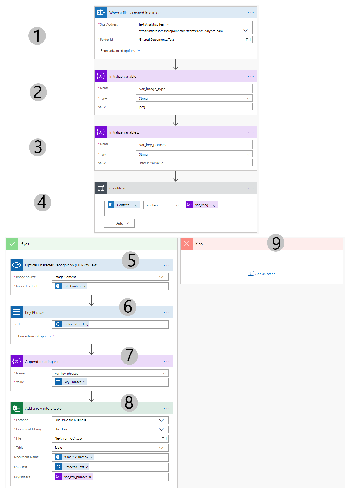

# Extract text and write to Excel when an image is added to SharePoint

## Overview
This example shows how to use Power Automate to extract text from an image and write to an Excel file. The workflow is triggered when a file is added to a SharePoint folder.

If the file is a jpeg image, then Azure OCR is called to extract the text. Then the text is passed to Text Analytics to extract the key phrases.

The output is then written to an Excel file. The sample file is in this folder called [Text from OCR.xlsx](Text%20from%20OCR.xlsx).

Here is the example's workflow:

## Pre-requisites

1. A valid Azure subscription - if you don't have one, create one for [free](https://azure.microsoft.com/en-us/free/services/cognitive-services/).
2. Create a Text Analytics resource (if you don't already have one)
- Start [here](https://docs.microsoft.com/en-us/azure/cognitive-services/cognitive-services-apis-create-account?tabs=singleservice%2Cwindows#create-a-new-azure-cognitive-services-resource)
- Select Text Analytics in step 1. Then create the resource.
- Get the key and endpoint 
- Skip the Configure the environment and Clean up sections
3. Computer Vision resource (similar to 2 above)
4. Power Automate - if you haven't already, sign up for free [here](https://docs.microsoft.com/en-us/power-automate/sign-up-sign-in)
5. OneDrive for Business (thru Office 365)[more info here](https://onedrive.live.com/about/en-US/business/)
- Upload the example Excel file (found in this folder) to your OneDrive for Business folder

## Create the flow in Power Automate
The entire flow is shown below. Steps are explained below.

### Step 1
This workflow is triggered on the action called "When a file is created in a folder (SharePoint)."

### Step 2
Initialize a variable to check for the file type of jpeg. You can check for other types as well such as png if needed.

### Step 3
Initialize a second variable to hold the output of Text Analytics.

### Step 4
Add a condition for checking to make sure the file is an image.

### Step 5
If yes, add an OCR to Text step to convert the image to text.

- If you don't have a connection, select Add new connection then enter the information to create a new Computer Vision connection.

   Connection Name: enter the name of the Computer Vision resource you created in the Azure Portal.  
   Account Key: Copy the value from Key1 field (see the Pre-requisites section above) 
   Site URL: copy the value from Endpoint field 

### Step 6
- Enter Text Anlaytics in the new step.
- If you don't have a connection, select Add new connection then enter the information to create a new Text Analytics connection.

   Connection Name: enter the name of the Text Analytics Resource you created in the Azure Portal. In this example, I had created a resource called TAforPowerAutomate.  
   Account Key: Copy the value from Key1 field (see the Pre-requisites section above) 
   Site URL: copy the value from Endpoint field  

Selec Text Analytics' key phrase function. Add en for English (you can choose other languages as well).

### Step 7
Append to string will store the results of the key phrase call.

### Step 8
This requires you to have uploaded the sample Excel file to OneDrive for Business. Note that it has a table which this flow will write into.

### Step 9
There is no input needed for the If no condition.

## The result
After you start the flow, drop [note.jpg](images/note.jpg) in the SharePoint folder you selected in the first step. The result would like this:

