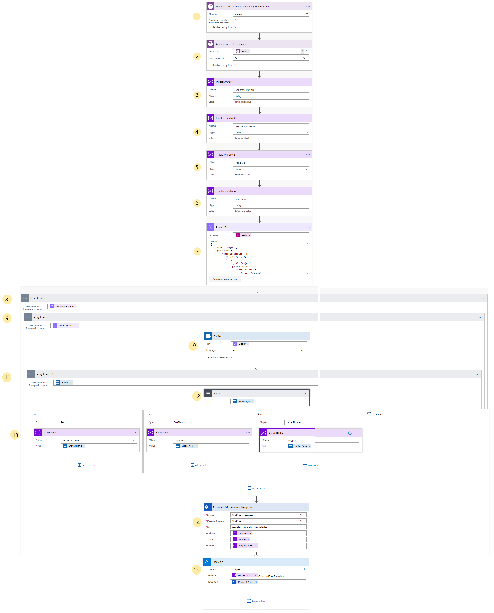
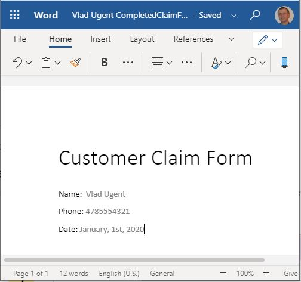

# Auto-fill forms with data from customer calls using Speech and Text Analytics APIs - Part II

In part II of this tutorial, we will use the data from the call transcript to fill in a claim form. [Link to Part I]() 

We will start with a blank form template in Word. Then populate the fields from the call transcript.

## Pre-requisites

- Upload the included sample claim form template to OneDrive for Business. To create your own claim template, [see](https://flow.microsoft.com/en-us/blog/generate-word-documents-in-your-flows/).

## Create the workflow

The below image shows the completed workflow. The steps are described in more detail below.

### Step 1

Add a trigger to fire when a file is added to Storage. This will start the process when the transcript from Part I is write here.

### Step 2

Get the content of the blob file (the transcript text).

### Step 3

Create a variable to hold the transcription.

### Step 4

Create a variable to hold the person name.

### Step 5

Create a variable to hold the date.

### Step 6

Create a variable to hold the phone number.

### Step 7

Parse the Json output. Click inside Content input box and select json() under Expression in dynamic content. Then click inside the parantheses and select File Content from the blob output.

To create the schema, click Generate from sample, and copy and paste the contents of the transcript json file created by the speech API call and written to the output blob.

### Step 8

Add Apply to each and from Dynamic content, select AudioFileResults.

### Step 9

Add Apply to each and from Dynamic content, select CombinedResults. We want the Display text from this json node.

### Step 10

Add Entities from Text Analytics, and select Display as input. Set the Language to en.

### Step 11

Add Apply to each and select Entities from Dynamic content.

### Step 12

Add a Switch control and set the On to Entity Type.

### Step 13

Create 3 cases to get and save the values for Person, DateTime and Phone_Number returned by the Entities call output.

Set the variables' values for each.

### Step 14

Inside the Applied to each for the Entities call (the second Apply to each), add an action to populate the claim template. Then set the variables.

### Step 15

Use Create File to save the updated template as a new doc.

Running the flow will create an updated Word document with the claim info filled in.

