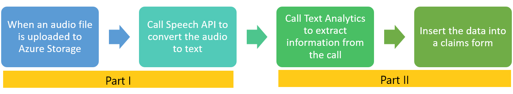
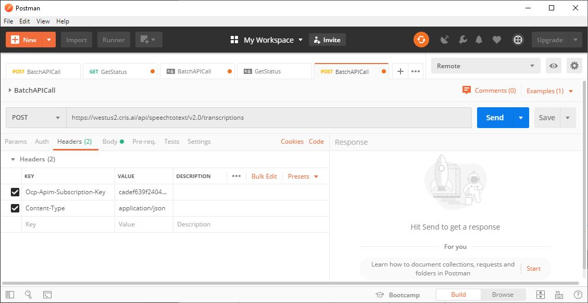
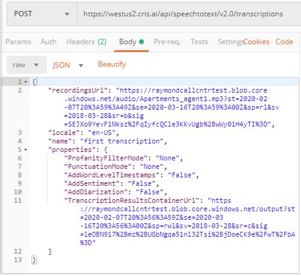
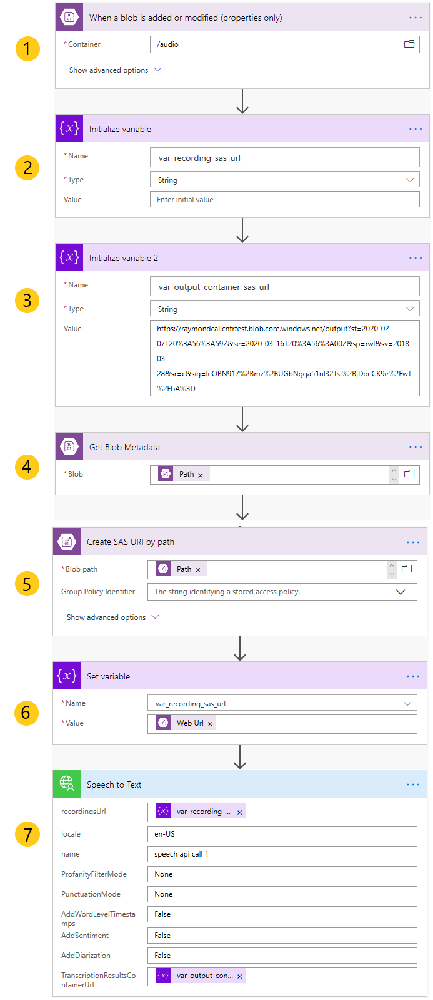

# Using customer calls to auto-fill forms using Speech and Text Analytics APIs

In this two part tutorial, we will extract information from a recorded customer call to automatically fill in a claim form.

We will use Power Automate to complete this tutorial. So no coding experience is required to build this automated workflow.

## Part I

We will use the Speech Batch API to convert audio to text.  

In part II, we use the text to fill in a claim form.

## Pre-requisites

- Azure subscription - if you don't have one, create one for [free](https://azure.microsoft.com/free/services/cognitive-services/).
- Text Analytics resource - if you don't have a TA resource:
  - Start [here](https://docs.microsoft.com/en-us/azure/cognitive-services/cognitive-services-apis-create-account?tabs=singleservice%2Cwindows#create-a-new-azure-cognitive-services-resource)
  - Select Text Analytics in step 1. Then create the resource.
  - Get the key and endpoint
  - Skip the Configure the environment and Clean up sections
- Speech API resource - if you don't have an STT resource:
  - Start [here](https://docs.microsoft.com/en-us/azure/cognitive-services/cognitive-services-apis-create-account?tabs=singleservice%2Cwindows#create-a-new-azure-cognitive-services-resource)
  - Select Speech Services
- [Azure Storage account](https://azure.microsoft.com/en-us/services/storage/)
- [Azure Storage Explorer](https://azure.microsoft.com/en-us/features/storage-explorer/)
- [Power Automate](https://preview.flow.microsoft.com/)
- Upload the sample audio file to Storage

## Create a custom connector for Speech

Before creating the Power Automate workflow, we need to create a custom connector for Speech Batch API since Power Automate doesn't have one currently. These steps are documented so I will just list them with the relevant information you need to plug in.

1. [Create a Postman collection](https://docs.microsoft.com/en-us/connectors/custom-connectors/create-postman-collection)

    a. I used Postman (there are couple other options). And plugged in the Speech API key and endpoint URL. Make sure the region matches your service. (see the Post URL in the first image)
    
    b. For getting the Key and endpoint URL, go to the Azure Portal.  

    c. Get the JSON input for the Speech API call [here](https://docs.microsoft.com/en-us/azure/cognitive-services/speech-service/batch-transcription#configuration).
    
    d. Use Azure Storage Explorer to get the Container SAS url for writing the output of the Speech API call.
    d. Use Azure Storage Explorer to get the recording URL parameter.
    
    d. Use Azure Storage Explorer to get the Container SAS url for writing the output of the Speech API call.

2. [Import the Postman collection](https://docs.microsoft.com/en-us/connectors/custom-connectors/define-postman-collection#import-the-postman-collection-for-power-automate-and-power-apps)

## Create the workflow

The below image shows the completed workflow. The steps are described in more detail below.

### Step 1

Add a trigger to fire when a file is added to Storage. Add a new connection and provide the Storage account information from the Azure Portal.

### Step 2

Create a variable to hold the audio file's SAS URL. Use Azure Storage explorer to upload the sample audio file, then create a SAS URL.

### Step 3

Create a variable to hold the output container's SAS URL. Speech API will write its transcription output here.

### Step 4

Get the path of the audio file that was added to blob storage in the trigger above.

### Step 5

Create a SAS URL using the file path.

### Step 6

Write the URL to the variable.

### Step 7

Use the Speech API custom connector to convert audio to text. 

## Next steps

In part II of this tutorial, we will use Text Analytics to extract information from the text transcript file created here.
